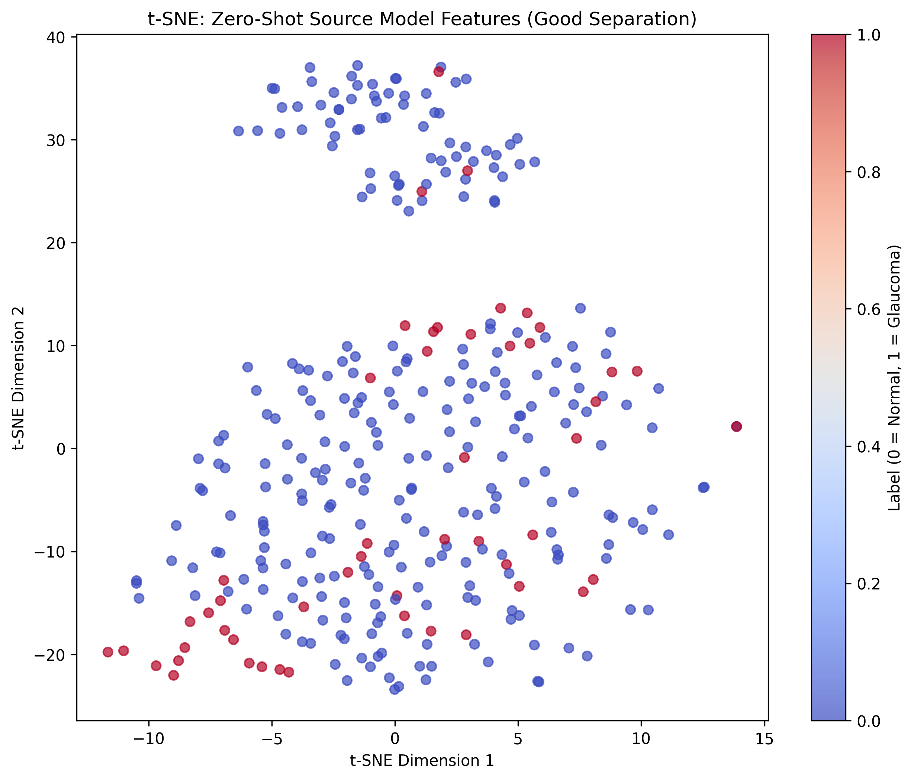
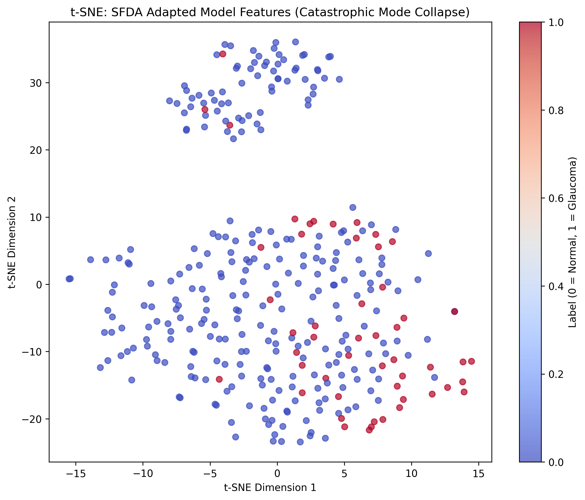

# The Illusion of Calibration

### Vulnerabilities of Unsupervised Test-Time Adaptation in Cross-Ethnic Glaucoma Screening

**Inesh Dheer** · IIIT Hyderabad · `inesh.dheer@research.iiit.ac.in`
**Varun Gupta** · IIIT Hyderabad · `varun.gup@students.iiit.ac.in`


[](https://www.python.org/downloads/)
[](https://pytorch.org/)
[](https://github.com/facebookresearch/dinov2)
[](https://github.com/facebookresearch/faiss)

---

## The Core Finding

> A foundation model trained entirely on European retinal images achieves **0.852 AUROC** on Indian retinas — nearly matching a fully supervised oracle (0.892). Applying state-of-the-art unsupervised adaptation to "help" it **destroys performance to 0.390 AUROC**, worse than random chance.

This project documents a rigorous empirical investigation that inverts prevailing assumptions about cross-ethnic domain adaptation in medical imaging. We coin this failure mode **the illusion of calibration**: an adapted model can correctly match the target-domain class distribution in aggregate, while completely destroying its ability to identify *which* patients actually have glaucoma.

---

## Why This Matters

Glaucoma is the second leading cause of irreversible blindness worldwide, projected to affect 111.8 million by 2040. Deep learning models for automated fundus screening routinely achieve expert-level performance — but almost exclusively on Western populations.

**The deployment problem:**
- Source datasets (e.g., AIROGS from the Netherlands) use standardised desktop cameras
- Indian clinical settings (Chákṣu) use handheld, non-mydriatic devices: darker pigmentation, glare, motion blur, uneven illumination
- GDPR prevents transferring source data; labelling target data requires expensive ophthalmologists
- *Source-Free Domain Adaptation* (SFDA) — adapting with only unlabelled target images — emerged as the theoretical solution

**This work shows that solution is currently dangerous.**

---

## Experimental Design

```
Source Domain (Europe)          Target Domain (India)
────────────────────────        ──────────────────────────────────────
AIROGS EyePACS dataset          Chákṣu dataset
n = 9,540 images                n = 1,345 images
512×512, desktop fundus         Remidio / Forus / Bosch handheld
50% glaucoma, 50% normal        ~15% glaucoma prevalence
Netherlands, standardised       Rural India, variable acquisition
```

**Backbone:** DINOv3 ViT-Large (303M parameters, 25.2M trainable — last 2 ViT blocks + 2-layer classification head)

**Four evaluation strategies:**

| Strategy | Description |
|---|---|
| Pretrained baseline | DINOv3 with random classifier head — no training |
| Zero-shot transfer | Source model (AIROGS-trained) directly on Chákṣu |
| Oracle | Trained on labelled Chákṣu data — theoretical ceiling |
| Netra-Adapt (SFDA) | Information Maximisation adaptation on *unlabelled* Chákṣu |

Additionally: a **RAG baseline** using FAISS-indexed nearest-neighbour retrieval across the 770-image AIROGS test set (grid search over k ∈ {5,10,20,50}, three aggregation methods).

---

## Results

| Model | Training Data | AUROC | Sensitivity | Specificity | F1 | Sens@95Spec |
|---|---|:---:|:---:|:---:|:---:|:---:|
| Pretrained (random head) | None | 0.487 | 0.20 | 0.91 | 0.227 | 0.12 |
| RAG (k=5, majority vote) | AIROGS (retrieval) | 0.509 | 0.25 | 0.74 | 0.231 | — |
| **Zero-shot (AIROGS → Chákṣu)** | **AIROGS** | **0.852** | **0.76** | **0.84** | **0.574** | **0.49** |
| Oracle (Chákṣu → Chákṣu) | Chákṣu (labelled) | 0.892 | 0.92 | 0.78 | 0.588 | 0.45 |
| **Netra-Adapt (SFDA)** | **AIROGS + Chákṣu (unlabelled)** | **0.390** | **1.00** | **0.01** | **0.266** | **0.02** |

**Test set:** 336 Chákṣu images (51 glaucoma, 285 normal), strictly held out.

Key observations:
- The zero-shot model (AUROC 0.852) trails the Oracle (0.892) by only 0.040 — a gap that costs no labels to achieve
- The RAG baseline fails entirely across all 12 configurations (AUROC 0.457–0.509), establishing that feature similarity cannot bridge ethnic domain shift
- Netra-Adapt degenerates to predicting glaucoma for virtually every image: 100% sensitivity, 1.4% specificity — a patient safety hazard

---

## The Illusion of Calibration — Explained

The Information Maximisation objective combines entropy minimisation (confident per-sample predictions) with a KL-divergence penalty enforcing the known Indian clinical prevalence (15% glaucoma):

```
L_total = λ_ent · L_entropy + λ_bal · KL(p̄ ‖ π)
```

The model satisfies `KL(p̄ ‖ π) ≈ 0` — it predicts the *correct proportion* of glaucoma cases. But this is achieved by exploiting demographic confounders: **device watermarks, melanin-driven colour differences, illumination artefacts**. The optimiser discovers it can satisfy the prior constraint by partitioning images on camera model rather than optic nerve pathology.

The result: the model is calibrated in aggregate, and completely wrong on individuals.

**Visual evidence:**

| t-SNE: Zero-Shot Source | t-SNE: After SFDA |
|---|---|
| Glaucoma clusters preserved | All discriminative structure destroyed |
|  |  |

Attention maps further confirm: the zero-shot model correctly localises the optic disc/cup. After adaptation, attention scatters randomly across clinically irrelevant fundus regions.


---

## Why the Foundation Model Generalises

DINOv3's self-distillation objective forces the model to learn **geometric invariants** of the optic nerve head — cup depth, rim width, vessel curvature — that are phenotype-agnostic. Unlike CNNs that overfit to pixel-level texture shortcuts, the ViT's global attention mechanism attends to structural relationships that hold across ethnicities.

This is why the AIROGS-trained model achieves 0.852 AUROC on Indian retinas without ever seeing one.

---

## Repository Structure

```
.
├── Run-7/                          # Full training pipeline
│   ├── train_source.py             # Source model training on AIROGS
│   ├── train_oracle.py             # Oracle training on Chákṣu (supervised ceiling)
│   ├── adapt_target.py             # Netra-Adapt SFDA (Information Maximisation)
│   ├── evaluate.py                 # Comprehensive evaluation: AUROC, Sens, Spec
│   ├── dataset_loader.py           # AIROGS + Chákṣu data pipelines
│   ├── models.py                   # DINOv3 ViT-L backbone + classification head
│   ├── visualize_attention.py      # DINOv3 [CLS] attention map extraction
│   ├── visualize_features.py       # t-SNE feature embedding visualisation
│   ├── training_logger.py          # Experiment tracking and logging
│   ├── run_full_pipeline.py        # End-to-end Python orchestration
│   └── run_everything.sh           # Full pipeline shell script
│
├── rag_glaucoma_screening/         # RAG baseline (FAISS nearest-neighbour)
│   ├── build_rag_database.py       # Index AIROGS embeddings with FAISS
│   ├── rag_retrieval.py            # k-NN retrieval with majority/weighted vote
│   ├── evaluate_rag.py             # Grid search over k and aggregation methods
│   ├── prepare_data.py             # Chákṣu preprocessing pipeline
│   └── run_rag_pipeline.py         # End-to-end RAG evaluation
│
├── Evaluation-Run-7/               # Experiment outputs (Run-7)
│   ├── results.txt                 # Full numeric results
│   ├── tsne_source.png             # t-SNE: zero-shot feature space
│   ├── tsne_adapted.png            # t-SNE: post-SFDA collapse
│   ├── attention_maps_comparison.png
│   ├── Source_AIROGS/              # Source model loss curves
│   ├── NetraAdapt/                 # Netra-Adapt training dynamics
│   └── Oracle_Chakshu/             # Oracle training dynamics
│
├── FinalSubmission/                # Research paper (LaTeX)
│   ├── main.tex                    # Full paper source
│   └── references.bib
│
└── Context/                        # Domain shift reference images
    ├── AIROGS.jpg                  # Sample European fundus (desktop camera)
    ├── Remidio.JPG                 # Sample Indian fundus (Remidio handheld)
    └── bosch.JPG                   # Sample Indian fundus (Bosch handheld)
```

---

## Running the Pipeline

**Prerequisites:**
```bash
pip install -r Run-7/requirements.txt
# Requires: AIROGS EyePACS-light-V2 and Chákṣu datasets
```

**Full pipeline (training through evaluation):**
```bash
cd Run-7
bash run_everything.sh
```

**Individual stages:**
```bash
# 1. Train source model on AIROGS
python train_source.py

# 2. Train Oracle on labelled Chákṣu (supervised ceiling)
python train_oracle.py

# 3. Run SFDA adaptation (Netra-Adapt)
python adapt_target.py

# 4. Evaluate all models
python evaluate.py

# 5. Generate t-SNE and attention visualisations
python visualize_features.py
python visualize_attention.py
```

**RAG baseline:**
```bash
cd rag_glaucoma_screening
bash setup_with_download.sh
python run_rag_pipeline.py
```

---

## Tech Stack

| Component | Technology |
|---|---|
| Foundation model | DINOv3 ViT-Large/16 (303M params, Facebook AI) |
| Training framework | PyTorch 2.0+ with AdamW, cosine annealing |
| Feature retrieval | FAISS IndexFlatL2 |
| Evaluation | scikit-learn (AUROC, sensitivity, specificity) |
| Visualisation | matplotlib, sklearn t-SNE |
| Data preprocessing | OpenCV, PIL (Chákṣu fundus extraction pipeline) |

---

## Clinical Implications

For cross-ethnic glaucoma screening deployment, the evidence prescribes a clear hierarchy:

1. **Use the zero-shot foundation model directly.** 0.852 AUROC with balanced sensitivity/specificity is clinically deployable as a first-pass screening tool.
2. **Do not apply unsupervised TTA.** The collapse to 0.390 AUROC constitutes a patient safety hazard in any real deployment.
3. **If resources permit, collect small labelled datasets.** The marginal Oracle gain (0.892 vs 0.852) may not justify annotation costs, but remains the safest option.

---
